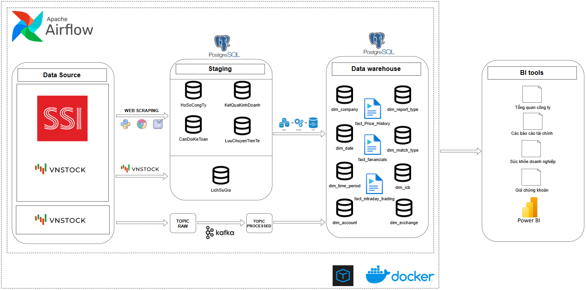
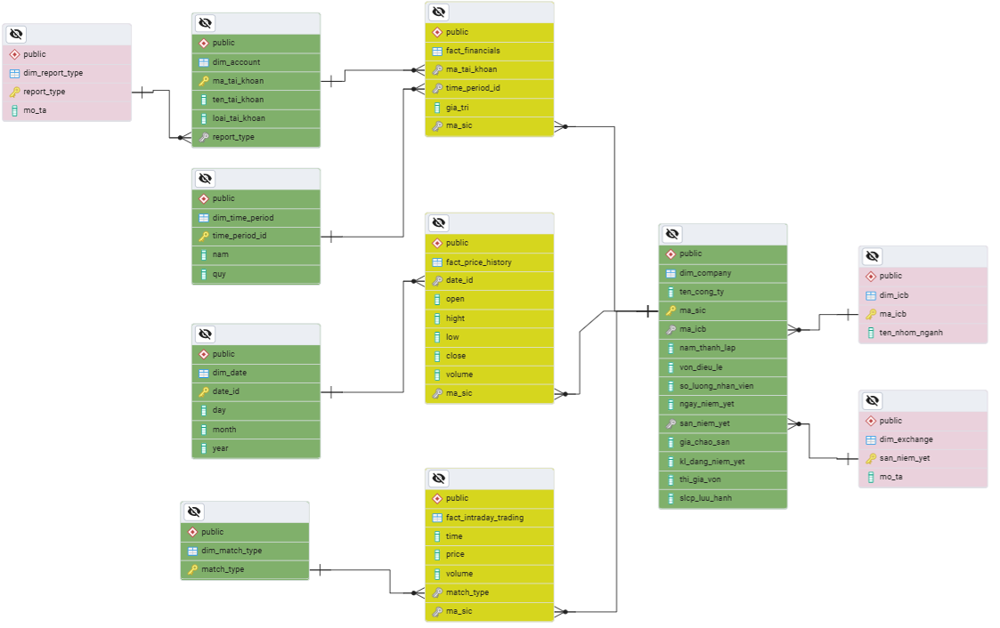
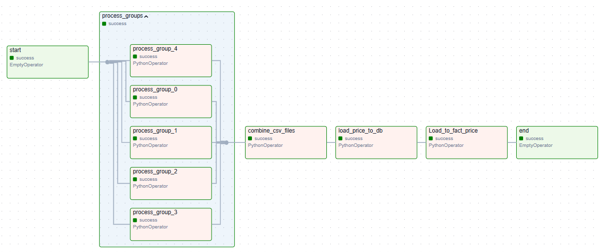
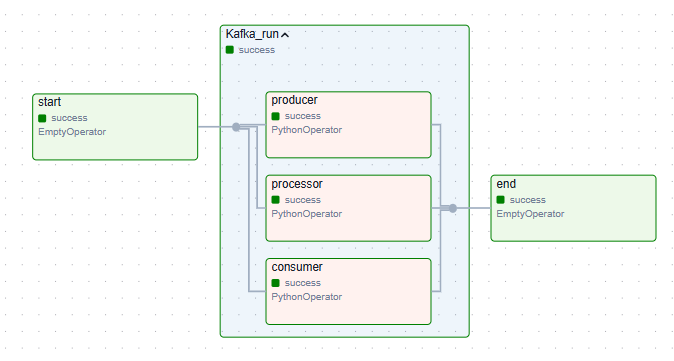
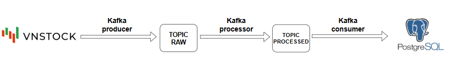
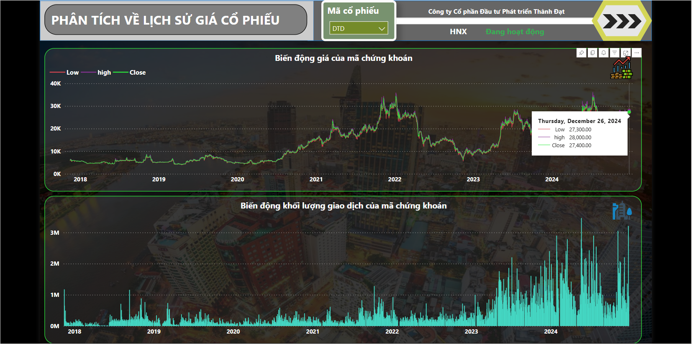
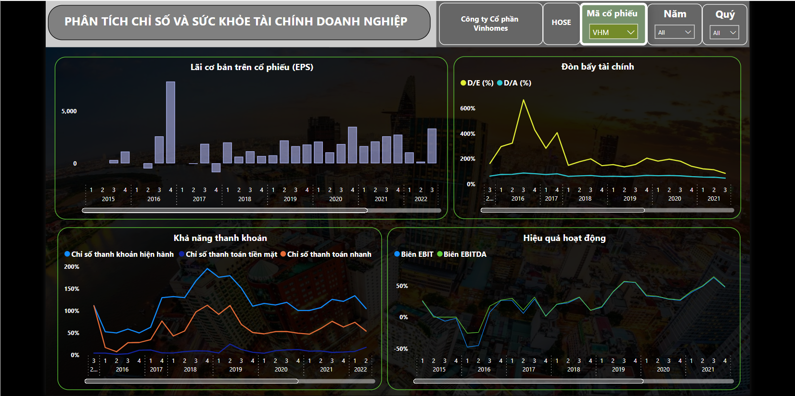
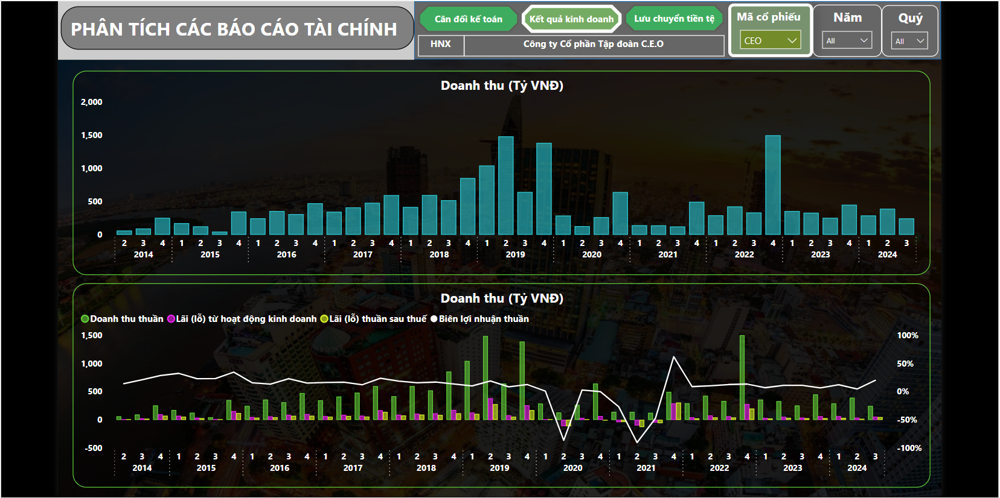
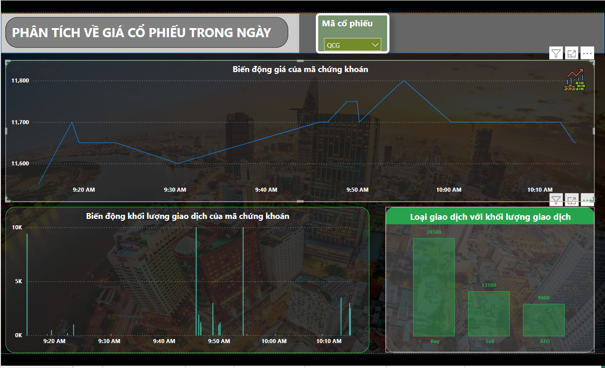

# 1.Overview
Dự án xây dựng kho dữ liệu chứng khoán bất động sản. Nguồn dữ liệu từ việc web scraping, hoặc từ thư viện Vnstock.

# 2. Kiến trúc dự án

Dưới đây là sơ đồ dự án:

Kiến trúc data warehouse

# 3. Một số luồng dữ liệu:

Pipeline thu thập giá chứng khoán

Pipeline quản lý mã nguồn kafka 

Cách kafka hoạt động

# 4. Một số dashboard:
dashboard lịch sử giá:

dashboard chỉ số tài chính

dashboard kết quả kinh doanh

dashboard kết quả trong ngày

# 4. Kết quả đạt được

Hoàn thành các dòng chảy dữ liệu tự động, hoàn chỉnh.